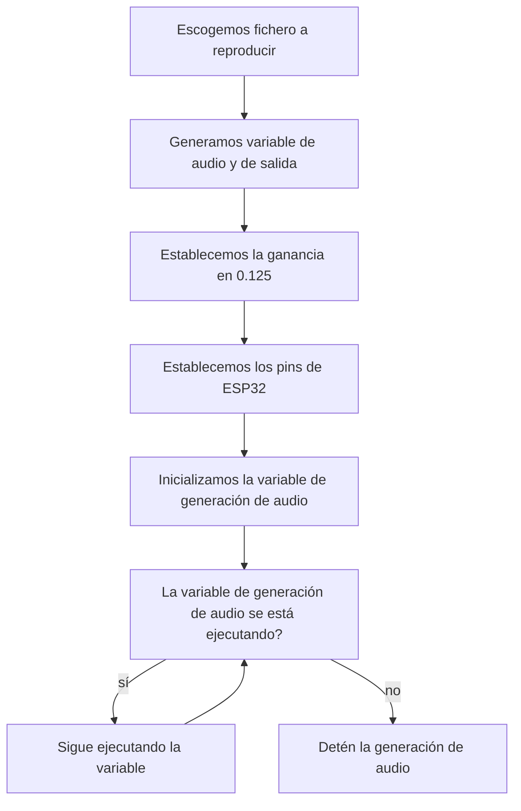
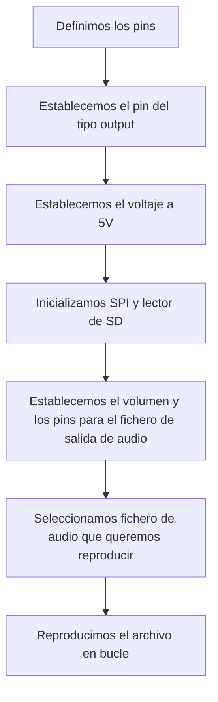

<<<<<<< HEAD
# Procesadores digitales

<div align="justify">

## Objetivo
El objetivo de esta práctica consiste en la comprensión de la comunicación I2S. Este protocolo es empleado para conectar diferentes dispositivos de audio digital, es decir, para poder reproducir un archivo de audio digital a partir de nuestro módulo ESP32. Utilizaremos, además, una placa de conexión de audio MAX98357 I2S para poder llevar a cabo la connexión. Esta práctica, se dividirá en dos partes: en la primera reproduciremos el archivo desde la memoria interna mientras que en la segunda, integraremos un lector de tarjetas SD y leeremos el archivo desde allí.

## Reproducción desde memoria interna

Para comenzar, para la correcta implementación del código, debemos utilitzar la librería de audio ESP8266 de Earle F. Philhower. Una vez hecho esto, debemos incluir los siguientes archivos con las cabeceras de las funciones que vienen con la biblioteca instalada anteriormente. Estas nos servirán para que la reproducción funcione.
```cpp
#include "AudioGeneratorAAC.h"
#include "AudioOutputI2S.h"
#include "AudioFileSourcePROGMEM.h"
#include "sampleaac.h"
```
En segundo lugar, creamos variables punteros para cada uno de los tipos de los archivos incluidos en el primer paso. 

```cpp
AudioFileSourcePROGMEM *in;
AudioGeneratorAAC *aac;
AudioOutputI2S *out;
```
Dentro del `setup()`, iniciamos el serial a una velocidad de `115200` y asignamos valores a las variables declaradas. Acorde con sus tipos, generamos el archivo de entrada con un ejemplo de la propia librería. También establecemos la ganancia y los pines de salida. Como último paso, debemos inicializar el generador de audio, con la entrada y la salida que estamos programando.

```cpp
in = new AudioFileSourcePROGMEM(sampleaac, sizeof(sampleaac));
aac = new AudioGeneratorAAC();
out = new AudioOutputI2S();
out -> SetGain(0.125);
out -> SetPinout(26,25,22);
aac->begin(in, out);
```
Dentro del `loop()`, damos una sola condición: mientras el generador de audio (`acc`) se esté ejecutando, que se siga ejecutando; en el momento que eso no se cumpla, detenemos la ejecución de la variable e imprimimos `Sound Generator`.
```cpp
if (aac->isRunning()) {
    aac->loop();
} else {
    aac -> stop();
    Serial.printf("Sound Generator\n");
    delay(1000);
}
```
Por lo tanto, el código entero es el siguiente:
```cpp
#include <Arduino.h>

#include "AudioGeneratorAAC.h"
#include "AudioOutputI2S.h"
#include "AudioFileSourcePROGMEM.h"
#include "sampleaac.h"

AudioFileSourcePROGMEM *in;
AudioGeneratorAAC *aac;
AudioOutputI2S *out;

void setup(){
Serial.begin(115200);
in = new AudioFileSourcePROGMEM(sampleaac, sizeof(sampleaac));
aac = new AudioGeneratorAAC();
out = new AudioOutputI2S();
out -> SetGain(0.125);
out -> SetPinout(26,25,22);

aac->begin(in, out);
}
void loop(){
    if (aac->isRunning()) {
        aac->loop();
    } 
    else {
        aac -> stop();
        Serial.printf("Sound Generator\n");
        delay(1000);
    }
}
```
Con una salida:
```cpp

```
### Diagrama de flujo


## Reproducción desde tarjeta SD externa

En primer lugar, debemos instalar la librería de audioI2S para poder incluir las variables de audio, la SD y el frame select (FS).
```cpp
#include "Audio.h"
#include "SD.h"
#include "FS.h"
```
A continuación, definimos los pins del ESP32 para cada una de las connexiones con el MAX98357 y el lector de SD y declaramos una variable de audio.
```cpp
#define SD_CS 5
#define SPI_MOSI 23
#define SPI_MISO 19
#define SPI_SCK 18
#define I2S_DOUT 25
#define I2S_BCLK 27
#define I2S_LRC 26

Audio audio;
```
Seguidamente, dentro del `setup()`, configuramos el pin para que sea del tipo `output`, de modo que con `digitalWrite()`, el voltaje se asigna en 5V para el lector de tarjetas SD. Iniciamos el bus SPI, la velocidad para la transmisión de datos a `115200` y el lector de SD. Por último, establecemos los pins de salida, el volumen y seleccionamos el fichero que queremos reproducir dentro de la tarjeta SD.

```cpp
pinMode(SD_CS, OUTPUT);
digitalWrite(SD_CS, HIGH);
SPI.begin(SPI_SCK, SPI_MISO, SPI_MOSI);
Serial.begin(115200);
SD.begin(SD_CS);
audio.setPinout(I2S_BCLK, I2S_LRC, I2S_DOUT);
audio.setVolume(10); // 0...21
audio.connecttoFS(SD, "Ensoniq-ZR-76-01-Dope-77.wav");
```
En el bucle, reproducimos infinitamente el fichero de audio. Si nos interesa, podemos dar uso a las funciones que se plantean a continuación, que muestran por el terminal distintas propiedades del fichero que estamos reproduciendo, por ejemplo el artista, la duración del audio, el título... Por lo tanto, el código entero es el siguiente:
```cpp
#include "Audio.h"
#include "SD.h"
#include "FS.h"

// Digital I/O used
#define SD_CS 5
#define SPI_MOSI 23
#define SPI_MISO 19
#define SPI_SCK 18
#define I2S_DOUT 25
#define I2S_BCLK 27
#define I2S_LRC 26

Audio audio;

void setup(){
    pinMode(SD_CS, OUTPUT);
    digitalWrite(SD_CS, HIGH);
    SPI.begin(SPI_SCK, SPI_MISO, SPI_MOSI);
    Serial.begin(115200);
    SD.begin(SD_CS);
    audio.setPinout(I2S_BCLK, I2S_LRC, I2S_DOUT);
    audio.setVolume(10); // 0...21
    audio.connecttoFS(SD, "Ensoniq-ZR-76-01-Dope-77.wav");
}
void loop(){
    audio.loop();
}
// optional
void audio_info(const char *info){
    Serial.print("info "); Serial.println(info);
}
void audio_id3data(const char *info){ //id3 metadata
    Serial.print("id3data ");Serial.println(info);
}
void audio_eof_mp3(const char *info){ //end of file
    Serial.print("eof_mp3 ");Serial.println(info);
}
void audio_showstation(const char *info){
    Serial.print("station ");Serial.println(info);
}
void audio_showstreaminfo(const char *info){
    Serial.print("streaminfo ");Serial.println(info);
}
void audio_showstreamtitle(const char *info){
    Serial.print("streamtitle ");Serial.println(info);
}
void audio_bitrate(const char *info){
    Serial.print("bitrate ");Serial.println(info);
}
void audio_commercial(const char *info){ //duration in sec
    Serial.print("commercial ");Serial.println(info);
}
void audio_icyurl(const char *info){ //homepage
    Serial.print("icyurl ");Serial.println(info);
}
void audio_lasthost(const char *info){ //stream URL played
    Serial.print("lasthost ");Serial.println(info);
}
void audio_eof_speech(const char *info){
    Serial.print("eof_speech ");Serial.println(info);
}
```
### Diagrama de flujo

=======
# PD_P7
>>>>>>> 79dabc2767953b63deadeac72fd774e4711fa076
